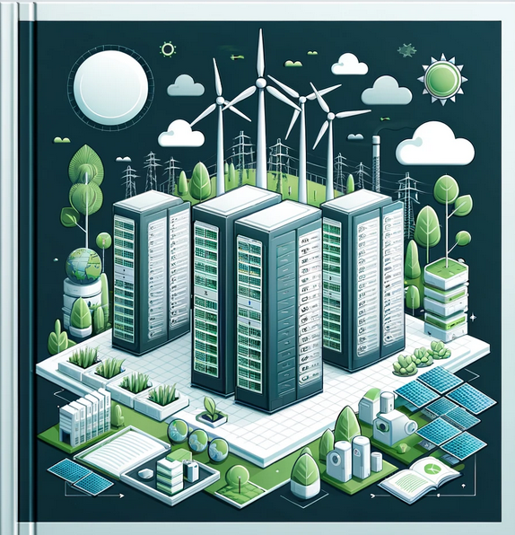
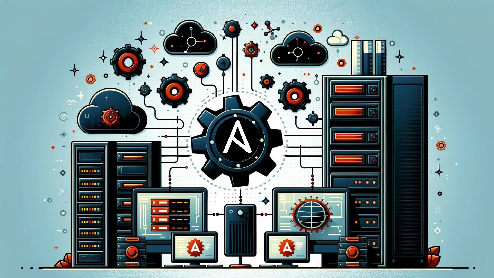
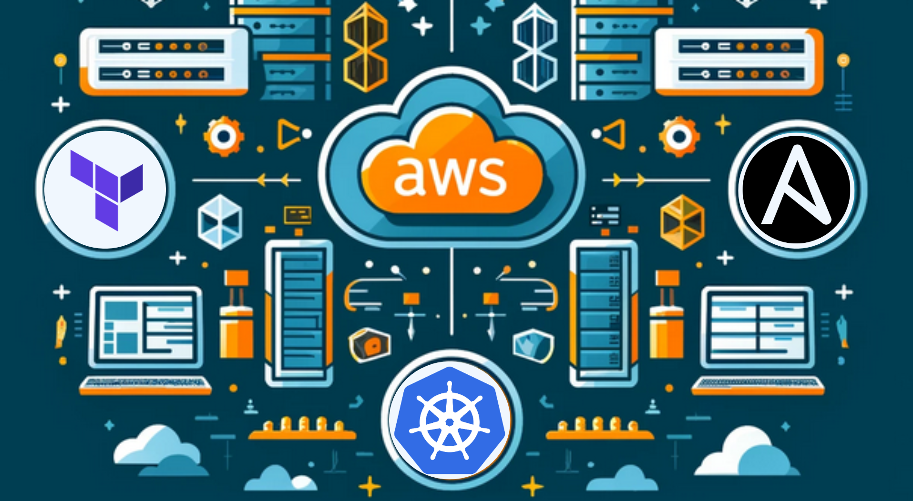

# 
🔥💻Bienvenido al Github de AndreuSG💻🔥  

 

 

## Sobre mí

<picture> </picture>

Hola, mi nombre es Andreu, tengo 24 años y soy un apasionado administrador de sistemas con un gran interés en el desarrollo y la programación, la ciberseguridad, y la combinación de ambas áreas que es DevOps. Actualmente, estoy perfeccionando mis habilidades en estos campos, formándome constantemente para estar al día con las últimas tecnologías y prácticas.

Me encanta colaborar en proyectos open source y contribuir a la comunidad tecnológica. En este perfil encontrarás una colección de proyectos en los que he trabajado a lo largo de mi trayectoria. Cada proyecto está documentado detalladamente para que puedas reutilizar el código fácilmente. Mi objetivo es compartir conocimientos y herramientas que puedan ayudar a otros profesionales y entusiastas de la tecnología.

Aquí dejo un breve resumen de los campos en los que estoy enfocado y algunas de las tecnologias que domino:

 

#### Administración de Sistemas 
Gestión y mantenimiento de infraestructuras TI utilizando diversas tecnologías:

|  |  |  |  |
| :---: | :---: | :---: | :---: |
|  |  |  |  |
|  |  |  |  |
|  |  |  |  |

 

#### Desarrollo Web 
Creación y mantenimiento de aplicaciones web utilizando las siguientes tecnologías:

|  |  |  |
| :---: | :---: | :---: |
|  |  |  |
|  |  |  |
|  |  |  |

 

#### Ciberseguridad 
Protección de sistemas y datos contra amenazas y vulnerabilidades:

|  |  |  |
| :---: | :---: | :---: |

 

#### DevOps 👨‍💻 
Integración de desarrollo y operaciones para mejorar la eficiencia y calidad en la entrega de software:

|  |  |
| :---: | :---: |
|  |  |

  

## Mis proyectos más destacados:

<table>
<tr>
<td width="50%">
<h3 align="center">Web per donar d'alta professorat</h3>

 
 

Aplicació web que permet al conserge loguejar-se , introduir professors, enviar correus electrònics de validació als professors automàticament, i gestionar les dades personals dels professors de manera segura i eficient.

                                                                                      
</td>

<td width="50%">
 
 
<h3 align="center">Creació i diseny d'un CPD</h3>

                                       

Planificació, instal·lació i configuració d'una infraestructura tecnològica robusta que pugui suportar el creixement continu de l'empresa. Aquest CPD està dissenyat per proporcionar una plataforma segura, fiable i escalable que permetrà a EcoTech gestionar les seves operacions de manera més eficient i innovadora.

                                                             
</table>                                                                                 

 

<table>

<tr>
<td width="50%">

 
 
 

<h3 align="center">Automatització amb Ansible</h3>

 

Exploració i aplicació pràctica d'Ansible com a eina d'automatització. El treball inclou una visió general de les característiques clau d'Ansible, així com la descripció detallada de diversos casos d'ús pràctics. Aquests casos van complicant-se a mesura que avança el projecte fins que finalment deixem un enllaç al nostre projecte final. Per garantir la seguretat i eficiència en la gestió de les màquines, totes les màquines del projecte han estat configurades per permetre l'accés només mitjançant clau pública. Aquesta tècnica, coneguda com a hardening (enduriment), millora la seguretat del sistema en limitar les formes d'accés i reduir les vulnerabilitats. En aquest projecte, l'Ansible Tower és l'única màquina que ha distribuït la seva clau pública a tots els nodes gestionats, assegurant així un control centralitzat i segur.

                                                                                      
</td>       

<td width="50%">
<h3 align="center">Curso Kotlin Multiplatform</h3>

 

 

    Automatitzar el desplegament d'infraestructura: Utilitzar Terraform per definir i desplegar la infraestructura necessària a AWS de manera automatitzada i repetible.  
    Configuració i gestió d'aplicacions: Utilitzar Ansible per automatitzar la configuració dels servidors i el desplegament de les aplicacions, assegurant una configuració consistent i una gestió eficient.
     
    Orquestració de contenidors: Utilitzar Kubernetes per gestionar i orquestrar els contenidors d'aplicacions, assegurant l'escalabilitat i la disponibilitat de les aplicacions.

                                                                                      
</td>  
</table>                                                                                 

 

Espero que mis proyectos te resulten útiles y te invito a colaborar y compartir tus ideas. ¡Vamos a construir juntos un futuro tecnológico mejor y al alcance de todos! 

